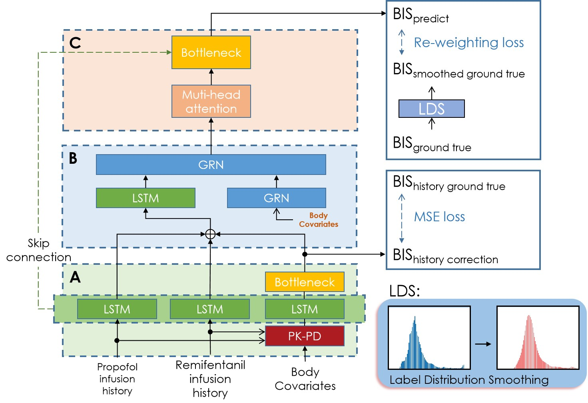

# Transformer-DOA-Prediction
**A Transformer-based Prediction Method for Depth of Anesthesia During Target-controlled Infusion of Propofol  and Remifentanil.**

**Abstract**: Accurate prediction of anesthetic effects is a very important part of target-controlled infusion system.
Bispectral index (BIS), one of the main indicators of anesthetic depth, has been widely predicted by the pharmacokinetic-pharmacodynamic (PK-PD) based models in clinical operation. However, these traditional PK-PD based models require to manually select the appropriate model parameters for each patient, which usually leads to a problem in clinical procedure. Furthermore, the recently proposed deep learning method for the BIS prediction can only reflect the general trends and lack the ability to predict the abrupt change situations.
To address these existing issues, this paper proposed a new transformer-based method for predicting the depth of anesthetic (DOA) by using the drug infusion of propofol and remifentanil simultaneously. Specifically, our proposed method first adopts the long short term memory (LSTM) network to correct the prediction results of the PK-PD model, and then utilizes the gate residual network (GRN) in the feature fusion layer to improve the efficiency of feature fusion. Finally, an improved attention mechanism approach is applied in the attention layers for explicitly discovering the interactions between propofol and remifentanil. Moreover, the label distribution smoothing (LDS) and reweighting losses are used to solve the issue of data imbalance.
Compared with previous works, our proposed method has some obvious advantages such as predicting anesthetic depth effectively under the sudden situation and the deep anesthesia stage.

**Experimental results show that our method significantly outperforms the traditional PK-PD model and the deep learning method:**

## Usage

The main requirements are pytorch 1.4.0 with python 3.9.1.

The [`mainer`](mainer) sets up a container with a main function for this project. Run ['main_featurefusion'](mainer/main_featurefusion.py) to begin training or testing.
The [`loader`](loader) deposit some programs to load drug and BIS record (which can access in [VitalDB](https://vitaldb.net/)). 

